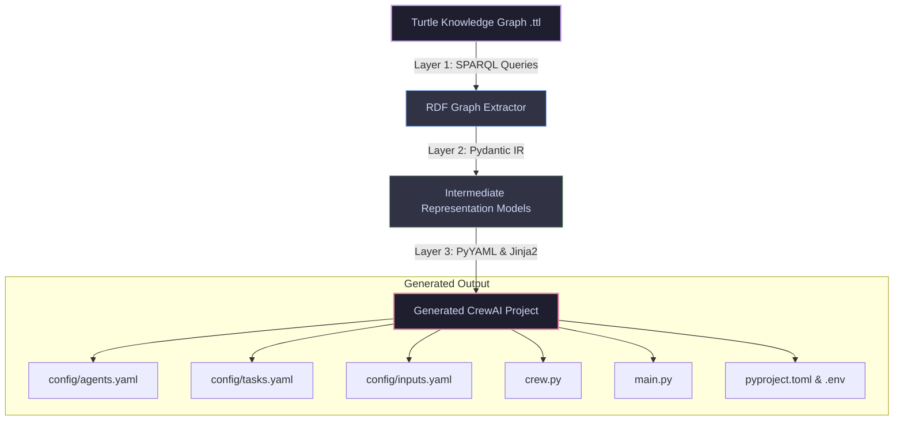

# Analysis of Knowledge Graph & Agentic AI Mapping

This document provides a comprehensive technical analysis of how semantic knowledge graphs (defined using the **Agentic AI Ontology** or `agentO.ttl`) are translated into executable **CrewAI** multi-agent systems via a **3-Layer Conversion Pipeline**.

---

## 1. Pipeline Architecture: Semantic-to-Code Translation

The project implements a highly structured 3-layer pipeline that reads Turtle (`.ttl`) knowledge graphs, parses them semantically, validates them through a strongly-typed intermediate representation, and produces standard, execution-ready CrewAI codebases.



### The Three Pipeline Layers
1. **Layer 1: SPARQL Extraction (`extractor.py`)**  
   Using RDFLib, the generator executes modular, well-defined SPARQL queries against the input knowledge graph to extract agents, tasks, dependencies, workflows, configurations, and environment variables.
2. **Layer 2: Pydantic IR (`models.py`)**  
   The raw query outputs are validated and deserialized into structured Pydantic models (such as `AgentModel`, `TaskModel`, `CrewProject`). This creates a clean framework-agnostic abstraction layer.
3. **Layer 3: File Generation (`generator.py`)**  
   The structured Pydantic models are passed into Jinja2 templates (for `.py` files) and PyYAML dumpers (for `.yaml` configurations) to output a complete, fully conforming CrewAI project hierarchy.

---

## 2. Ontology-to-Framework Mapping

The translation of semantic classes and properties to the CrewAI programming model is guided by direct conceptual mappings:

| Agentic AI Ontology (`agentO.ttl`) | CrewAI Framework Equivalent | Mapping Details & Parameters |
| :--- | :--- | :--- |
| **`:Team`** | `Crew` Class | Aggregates agents and tasks. Decoded from `:hasAgentMember`. |
| **`:LLMAgent`** | `Agent` decorator (`@agent`) | Defined using `:agentRole` (role), `:hasAgentGoal` (goal), and `:agentPrompt` (backstory). |
| **`:Task`** | `Task` decorator (`@task`) | Defined using `description`, `expected_output` (derived from `:promptOutputIndicator`), and associated agent. |
| **`:WorkflowPattern`** | `Process` configuration | Determines how tasks are sequenced (e.g., `:StartStep`, `:WorkflowStep`, `:EndStep` map to `Process.sequential`). |
| **`beam:Resource`** | Task Context / Outputs | Determines task execution flow and dependency injection (`context=[...]`). |
| **`:Config`** | YAML config files / Environment | Maps parameters such as config files (`agents.yaml`, `tasks.yaml`) or runtime environment variables. |
| **`:LanguageModel`** | LLM Settings / Providers | Maps LLM configuration parameters to custom langchain or crewai model classes. |

---

## 3. Workflow & Dependency Mapping

One of the most critical aspects of the mapping is representing **task dependencies** and **data-flow sequencing** without relying on explicit procedural code. The ontology uses a combination of workflow steps and resource definitions to express this semantically:

### Task Context Mapping
In CrewAI, sequential execution alone is often not enough; downstream tasks frequently require the output of upstream tasks as input context (`context=[task_1]`). The pipeline resolves this by inspecting resource relationships:
- If `:task_review` has `:requiresResource` linking to `:initial_game_code_resource`, and `:initial_game_code_resource` was `:producedResource` by `:code_task`, the pipeline semantically infers that `:review_task` depends on `:code_task`.
- This is automatically mapped to `context=[self.code_task()]` in the generated `crew.py`!

### Runtime Input Resolution
Custom inputs are modeled using the `agento-ext:KickoffInputBundle` extension.
- The default value marked by `agento-ext:isDefaultValue true` is utilized as the primary input parameter.
- Alternative inputs are gathered as a list, allowing the user to seamlessly switch configurations inside `inputs.yaml` without editing python code.

---

## 4. Semantic Gaps & Pipeline Workarounds

While the ontology represents the system’s high-level semantics, certain framework-specific runtime requirements cannot be natively modeled without overly bloating the ontology. The pipeline resolves these gaps elegantly:

> [!NOTE]
> **Gap 1: Task Expected Output**  
> CrewAI strictly requires `expected_output` for all tasks to evaluate completion, but the core ontology lacks a native expected output property.  
> *Pipeline Resolution:* The generator maps `Prompt.promptOutputIndicator` associated with a task's prompt to `expected_output` in `tasks.yaml`.

> [!TIP]
> **Gap 2: Crew-Level Execution Flow**  
> The ontology describes sequence steps but has no direct notion of a central manager agent or execution modes.  
> *Pipeline Resolution:* Step order and step linkages (`:nextStep`) are parsed. A sequential workflow maps to `Process.sequential`, while more complex step structures map to hierarchical configurations.

---

## 5. Runtime Compatibility & Python 3.14 Resolutions

When executing the generated CrewAI codebase in modern Python environments (Python 3.14+), the team encountered a critical compatibility issue related to **PEP 649 (Deferred Annotations)**. 

### The Problem
Starting with Python 3.14, type annotations are evaluated lazily. Because of this, standard class creation mechanisms do not populate the `__annotations__` dictionary immediately. When `ModelMetaclass` in **Pydantic V1** runs during class creation (which is heavily utilized inside `chromadb` and older `crewai` versions), it fails to locate the type hints, raising a fatal `pydantic.v1.errors.ConfigError` or `AttributeError`.

### The Resolution
To overcome this without downgrading Python, we successfully analyzed and implemented a metaclass-level runtime patch in Pydantic's core class creator (`pydantic/v1/main.py`):

```python
# Evaluates lazily-defined annotations in Python 3.14+ during metaclass initialization
if (namespace.get('__module__'), namespace.get('__qualname__')) != ('pydantic.main', 'BaseModel'):
    if '__annotations__' not in namespace and '__annotate_func__' in namespace:
        try:
            namespace['__annotations__'] = namespace['__annotate_func__'](1)
        except Exception:
            pass
    annotations = resolve_annotations(namespace.get('__annotations__', {}), namespace.get('__module__', None))
```

This patch forces the evaluation of the new PEP 649 `__annotate_func__` hook if `__annotations__` is empty, ensuring seamless backward-compatibility for Pydantic V1 features on modern Python runtimes.

---

## 6. Summary of Key Strengths

1. **High Fidelity Mapping:** Keeps prompts, goals, backstories, and roles completely intact from the RDF turtle graph to the final YAML files.
2. **Context Resolution:** Smart resource-based dependency parsing ensures that agent coordination logic matches the knowledge graph structure.
3. **Decoupled Architecture:** Using YAML configurations for definitions and Jinja2 for code ensures that the generated codebase is modular, clean, and highly readable.
